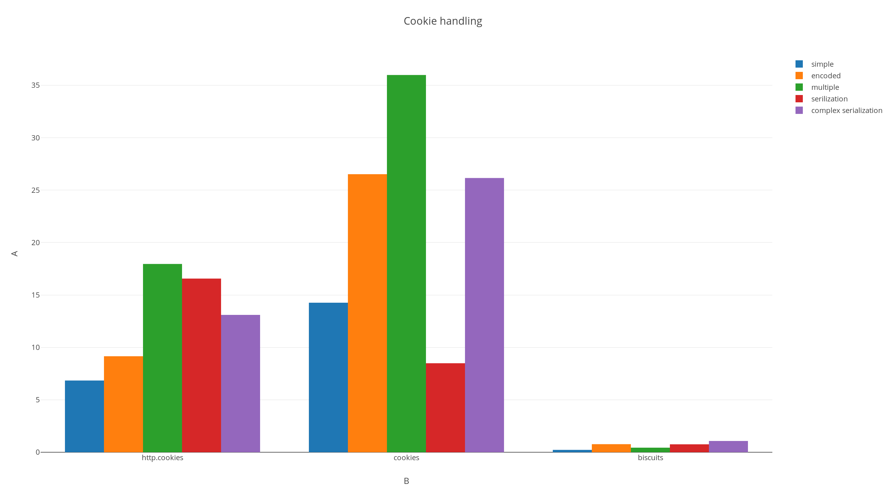

# Biscuits

Low level API for handling cookies server side.

## Install

    pip install biscuits

## API

    # Parse a "Cookie:" header value:
    from biscuits import parse
    parse('some=value; and=more')
    > {'some': 'value', 'and': 'more'}

    # Generate a "Set-Cookie:" header value:
    from biscuits import Cookie
    cookie = Cookie(name='foo', value='bar', domain='www.example.org')
    str(cookie)
    > "foo=bar; Domain=www.example.org; Path=/"

## Building from source

    pip install cython
    make compile
    python setup.py develop

## Testing

    make test

## Benchmark

See [Benchmark](https://github.com/pyrates/biscuits/wiki/Benchmark) for more
details.

## Changelog

### 0.2

- unescape antislash when parsing to be consistent with quoting (cf #3)
- unescape octal ascii when parsing to be consistent with quoting (cf #4)

### 0.3

- add support for the SameSite attribute (cf #8)
